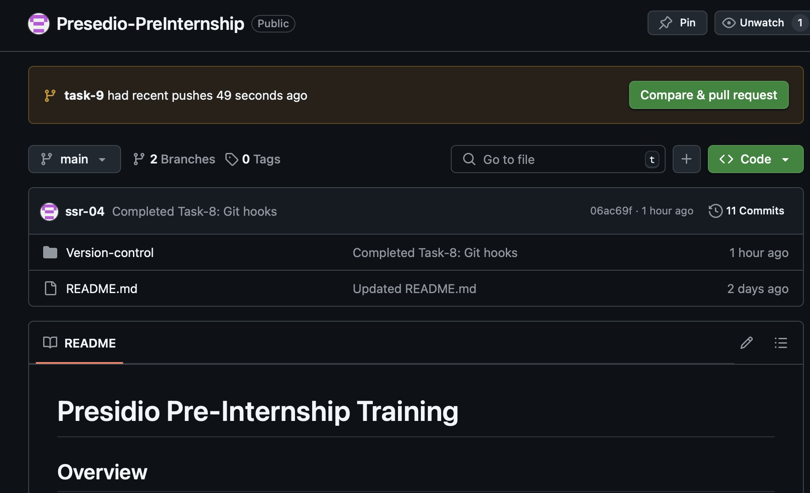
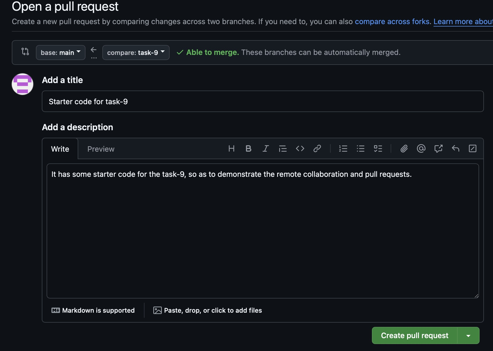
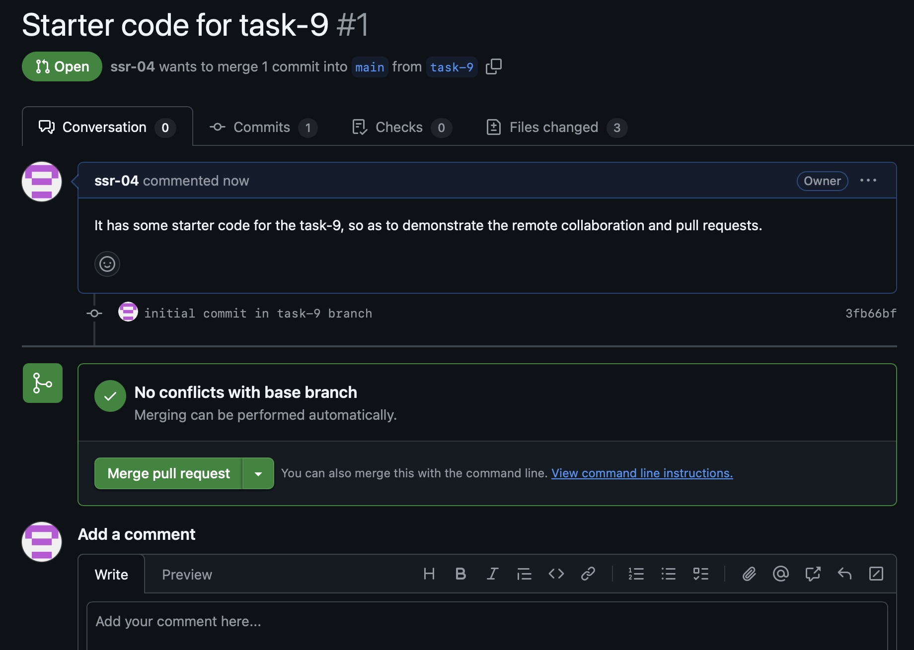
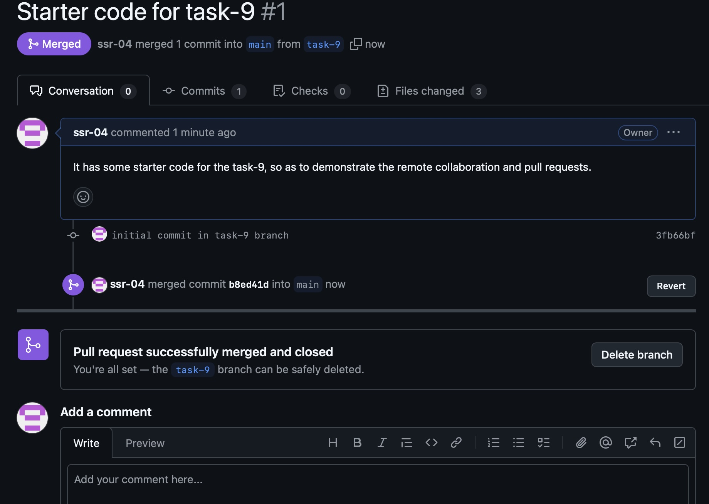

# **Task-9: Working with Remote Repositories and Collaboration**

## **Objective**
This task demonstrates a **collaborative Git workflow** using **remote repositories**. We simulate a typical feature development process, including **branching, committing, pushing, creating pull requests (PRs), merging, and pulling updates locally**.

---

## **Implementation Steps**

### **1️⃣ Create a Feature Branch for Task-9**
First, we create a new branch to isolate changes for Task-9:

```bash
git switch -c task-9
```

Now, running `git branch -a` confirms the new branch:

```bash
(base) sachinsabariram@Sachins-MacBook-Air Version-control % git branch -a
  main
* task-9
  remotes/origin/HEAD -> origin/main
  remotes/origin/main
```

---

### **2️⃣ Implement Task-9 Locally**
We create the required files in the `task-9` directory:

```bash
mkdir task-9
cd task-9
touch task.txt output.txt README.md
```

Checking file contents:

```bash
(base) sachinsabariram@Sachins-MacBook-Air task-9 % head -n 3 task.txt
**Working with Remote Repositories and Collaboration**

**Objective:**
```

Now, we stage and commit the files:

```bash
git add .
git commit -m "Initial commit in task-9 branch"
```

---

### **3️⃣ Push the Feature Branch to GitHub**
We push `task-9` to the remote repository:

```bash
git push origin task-9
```

Git confirms the branch is now available remotely:

```
remote: Create a pull request for 'task-9' on GitHub by visiting:
remote:      https://github.com/ssr-04/Presedio-PreInternship/pull/new/task-9
```

📸 **Screenshot:**  


---

### **4️⃣ Create a Pull Request (PR)**
1️⃣ Navigate to GitHub, click **"Compare & pull request"**.  
2️⃣ Add a title and description:

- **Title:** _Starter code for Task-9_
- **Description:** _It has some starter code for Task-9 to demonstrate remote collaboration and pull requests._

📸 **Screenshot:**  


---

### **5️⃣ Review & Merge the PR**
1️⃣ The PR appears with **"No conflicts with the base branch"**.  
2️⃣ Click **"Merge pull request"**, then confirm.  
3️⃣ The PR is merged and closed.

📸 **Screenshots:**
- 
<br><br>
- 

---

### **6️⃣ Sync Local Repository with Remote (`git pull`)**
After merging on GitHub, update the local repository:

```bash
git switch main
git pull origin main
git branch -d task-9  # Delete the local branch
```

---

## **Final Git Output (`output.txt`)**
```bash
(base) sachinsabariram@Sachins-MacBook-Air task-9 % git branch -a
* main
  remotes/origin/HEAD -> origin/main
  remotes/origin/main
  remotes/origin/task-9
```

---

## **Key Takeaways**
- **Branching** keeps feature development isolated.
- **Pull Requests** enable collaboration and code review.
- **Merging** integrates changes safely.
- **Syncing (`git pull`)** keeps local repositories updated.

This workflow **improves code quality and collaboration** in team projects.

---